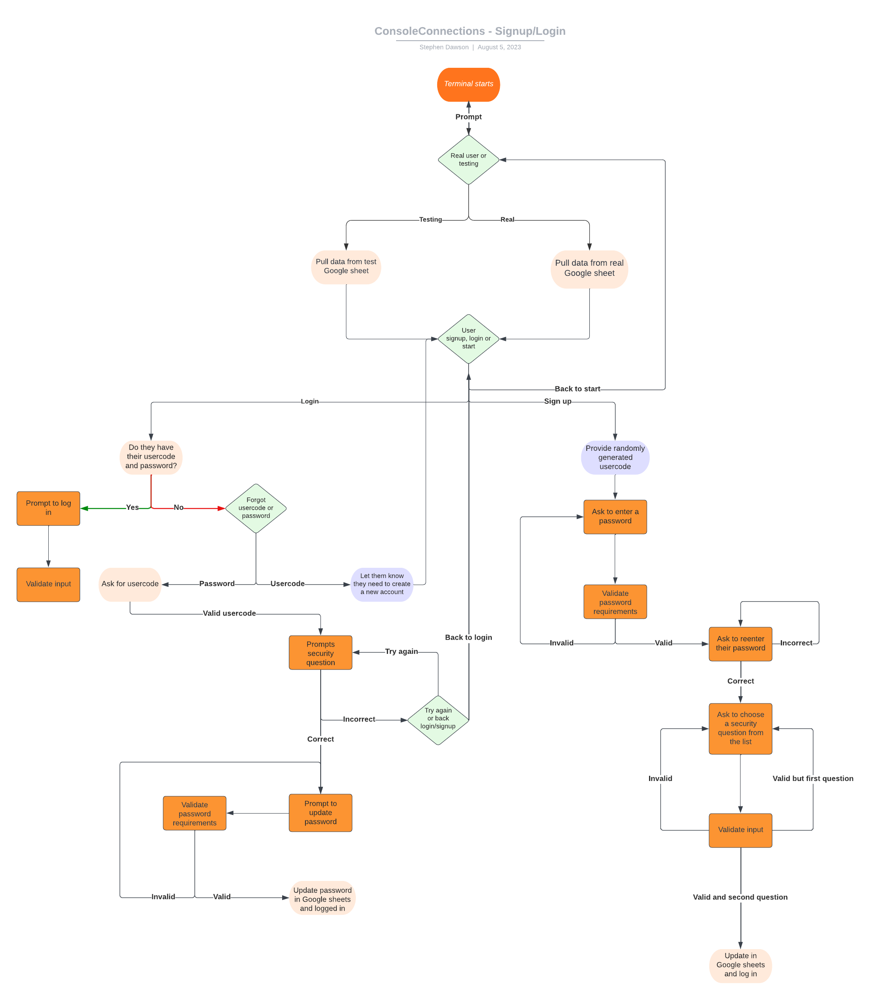
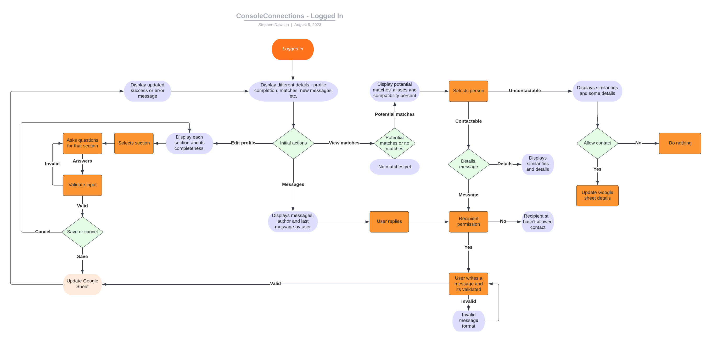

# Console Connections - CI PP3

[Click here to use the live Console Connections App](https://console-connections-5cf111ff9c73.herokuapp.com)

Console Connections is a terminal-based dating app. By setting your age and gender preferences, and answering a few compatibility questions, you can find a match (or matches). Once both of you have allowed for contact, you can send messages to each other. The app runs in the Code Institute Mock Terminal, which is deployed on Heroku.

## Table of Contents
- [**Using the app - Login/Registration steps**](#using-the-app---loginregistration-steps)
  - [**Establishing user type**](#establishing-user-type)
  - [**Signing up**](#signing-up)
  - [**Logging in**](#logging-in)
- [**Using the app - After logging in**](#using-the-app---after-logging-in)
  - [**Main menu**](#main-menu)
  - [**Compatibility quiz**](#compatibility-quiz)
  - [**Edit profile**](#edit-profile)
  - [**View matches**](#view-matches)
  - [**View messages**](#view-messages)
  - [**Log out**](#log-out)
- [**Planning**](#planning)
  - [**User stories**](#user-stories)
  - [**Flowcharts**](#flowcharts)
    - [**Flowchart before logging in or signing up**](#flowchart-before-logging-in-or-signing-up)
    - [**Flowchart after logging in or signing up**](#flowchart-after-logging-in-or-signing-up)
  - [**Google sheet headings**](#google-sheet-headings)
  - [**Messages structure**](#messages-structure)
- [**Features**](#features)
  - [**Test mode or real mode**](#test-mode-or-real-mode)
  - [**Login and signup options**](#login-and-signup-options)
  - [**Unique usercode generation**](#unique-usercode-generation)
  - [**Security questions and answers for credential recovery**](#security-questions-and-answers-for-credential-recovery)
  - [**Main menu**](#main-menu-1)
  - [**Compatibility quiz**](#compatibility-quiz-1)
  - [**Edit profile**](#edit-profile-1)
  - [**View matches**](#view-matches-1)
  - [**View messages**](#view-messages-1)
  - [**Message matches**](#message-matches)
  - [**Log out**](#log-out-1)
- [**Testing**](#testing)
- [**Deployment**](#deployment)
- [**Bugs and issues table**](#bugs-and-issues-table)
- [**Resources used**](#resources-used)


## Using the app - Login/Registration steps

### Establishing user type
When the user runs the app, they are presented with the option to choose whether they are a test user or a real user. The reason for this is that the app is connected to a Google Sheet, and the test sheet is full of dummy data (and other test user data), so it's best to use the test user option to avoid messing up the real user data.

### Signing up
After selecting whether or not the user is a test user or real user. The user will be given the opportunity to log in or sign up for an account. When they choose to sign up, a six-digit usercode is generated for them. If they complete the signup process, that will be their usercode for logging in in the future. During the signup process, the user is asked to create a password, add two security questions (for password/usercode recovery) and to create an alias any in-app communication. Once they have provided that information, the user's information is added to the Google Sheet. They are also logged in and taken to the main menu.

### Logging in
When the user chooses to log in, they are asked to provide their usercode. Since the Google Sheet type is already selected, the usercode is checked against the Google Sheet. If the usercode is found, the user is asked to provide their password. If the password is correct, the user is logged in and taken to the main menu. If the password is incorrect, the user is asked to try again.

## Using the app - After logging in

### Main menu
Once logged in, the user is presented with the main menu. From here, they can choose to view their compatibility quiz answers or take the quiz, edit some of their profile details, view their matches, view their messages, message their matches or log out.

### Compatibility quiz
The compatibility quiz is a series of ten questions. The user is presented with a question that has two to four options. They can choose one of the options by typing the number of the option. Once they have answered all ten questions, their answers are saved to the Google Sheet. If they choose to retake the quiz, they are taken back to the start of the quiz. If they choose not to retake the quiz, they are taken back to the main menu.

### Edit profile
On the edit profile page, the user is presented with the information they can't change and the information that they can change. The user can update their password, their security questions, their bio, the genders they want to match with and the age range they want to match with. If they make a change to their profile, it won't be saved until they click the "Save and exit" option. Once they save, the data is updated in the Google Sheet and they are taken back to the main menu.

### View matches
On the view matches page, the user is presented with a list of their matches. A potential match will only be considered when:
1. The potential match's age is within the age range that the user wants to match with.
2. The user's age is within the age range that the potential match wants to match with.
3. The potential match's gender is one of the genders that the user wants to match with.
4. The user's gender is one of the genders that the potential match wants to match with.

Once other users are filtered by gender and age preferences, the answers of the compatibility tests are compared. A user must have a compatibiltiy score of 60% or more in order to display a match. The list is sorted by the matches with the highest compatibility. From there, the user can choose to view the match's profile. If both users have allowed for contact, the user can also choose to message the match.

### View messages
On the view messages page, the user is presented with a list the last messages sent by their matches. The list is sorted by the most recent message received from a match. The user can choose to view the messages from a match. From there, they can choose to send a message to the match.

### Log out
When the user chooses to log out, they are logged out and taken back to the login/signup page.

## Planning

### User stories

As a first-time user, I want:
- to be able to sign up for an account
- to be able to edit my profile
- to be able to take a compatibility quiz
- to be able to view my matches
- to log out of my account

As a returning user, I want:
- to be able to log in to my account
- to be able to edit my profile
- to be able to view my messages
- to be able to message my matches

As a frequent user, I want:
- to be able to edit my profile
- to be able to view my message history
- to see new matches as they become available

### Flowcharts
#### Flowchart before logging in or signing up


#### Flowchart after logging in or signing up



### Google sheet headings

I used Google Sheets to store user's data, compatibility quiz answers and messages. There were some iterations of the headings used in the sheet:

#### Initial Google Sheet headings:

usercode,	password, alias,	security_question_1,	security_answer_1, security_question_2,	security_answer_2,	bio,	gender,	genders_seeking,	age,	age_range_seeking,	messages_sent,	messages_received,	allow_contact_list,	question_1,	question_2,	question_3,	question_4,	question_5,	question_6,	question_7,	question_8,	question_9,	question_10	

#### Second iteration of Google Sheet headings:

usercode,	password,	alias,	security_questions,	age,	gender,	bio,	genders_seeking,	age_range_seeking,	messages_sent,	messages_received,	allow_contact_list,	compatibility_answers

#### Final iteration of Google Sheet headings:
 usercode, password, alias, security_questions, age, gender, bio, genders_seeking, age_range_seeking, messages, allow_contact_list, compatibity_answers, row_num													

### Messages structure

The structure of messages was a little tricky as it required some nested lists. I decided to store the messages in the Google Sheet as a string. I used the json module to convert the string to a list. I used the following message structure in user's message section:
```
[
  [usercode, last_message_received_timestamp, 
    [
      [message, user_sent(true/false), timestamp],
      [message, user_sent(true/false), timestamp]
    ]
  
  ],
  [another_usercode, last_message_received_timestamp, 
    [
      [message, user_sent(true/false), timestamp],
      [message, user_sent(true/false), timestamp]
    ]
  ],
  [another_usercode, last_message_received_timestamp, 
    [
      [message, user_sent(true/false), timestamp],
      [message, user_sent(true/false), timestamp]
    ]
  ]
]
```

## Features

### Test mode or real mode

Users can choose whether to use test data or if they want to actually use the app.
SCREENSHOT 

### Login and signup options
Existing users can sign in and new users can sign up.
SCREENSHOT 

### Unique usercode generation
Each user is assigned a unique usercode to log into the app.
SCREENSHOT

### Security questions and answers for credential recovery
Users can set two security questions and answers to help them recover their password or usercode. SCREENSHOT

### Main menu
The main menu after users have logged in. Provides users with a number of options to choose from. SCREENSHOT

### Compatibility quiz
Users can take a compatibility quiz to help them find matches. SCREENSHOT

### Edit profile
Users can edit their profile details. SCREENSHOT

### View matches
Users can view their matches. SCREENSHOT

### View messages
Users can view their messages. SCREENSHOT

### Message matches
Users can message their matches. SCREENSHOT

### Log out
Users can log out of their account. SCREENSHOT

## Testing

I used the Code Institute Mock Terminal to test the app. I asked family and friends to test both the test user and real user versions of the app. I also tested the app myself. I used the following test cases:

| Test Case | Test Steps | Expected Result | Actual Result | Pass/Fail |
|-----------|------------|-----------------|---------------|-----------|
| User signup | 1. Select test user option <br>2. Select signup option <br>3. Enter usercode <br>4. Enter password <br>5. Enter security questions <br>6. Enter security answers <br>7. Enter alias | User is signed up and taken to main menu | User is signed up and taken to main menu | Pass |
| User login | 1. Select test user option 2. Select login option 3. Enter usercode 4. Enter password | User is logged in and taken to main menu | User is logged in and taken to main menu | Pass |
| User views matches without completing compatibilty quiz | 1.Sign up <br>2. Select view matches option | User is shown a message that they need to complete the compatibility quiz | User is shown a message that they need to complete the compatibility quiz | Pass |
| User views compatibilty quiz answers without answer | 1. Sign up <br>2. Select compatibility quiz option <br>3. Select view quiz answers option | User is shown a message that they have not yet completed the compatibility quiz | User is shown a message that they need to complete the compatibility quiz | Pass |
| User takes compatibility quiz and finishes | 1. Select compatibility quiz option <br>2. Answer all questions | User is shown a message that they have completed the compatibility quiz | User is shown a message that they have completed the compatibility quiz | Pass |
| User views compatibilty quiz answers after completing quiz | 1. Select compatibility quiz option <br>2. Select view quiz answers option | User is shown a message that they have not yet completed the compatibility quiz | User is shown a message that they have completed the compatibility quiz | Pass |
| User clicks "Return to main menu" on compatibility screen | 1. Select compatibility quiz option <br>2. Select return to main menu option | User is taken back to the main menu | User receives a message saying they are going back to main menu and is taken back to the main menu | Pass |
| User views matches without completing their profile but completed compatibilty quiz | 1. Sign up <br>2. Select view matches option | User is shown a message that they need to fill out the genders seeking section | User is shown a message that they need to complete their profile | Pass |
| User clicks edit profile option | 1. Select edit profile option | User is taken to the edit profile screen | User is taken to the edit profile screen | Pass |
| User edits their profile and saves | 1. Select edit profile option <br>2. Edit profile details <br>3. Select save and exit option | User's profile is updated is taken back to the main menu | User is taken back to the main menu and profile is updated | Pass |
| User views messages without matching with anyone | 1. Sign up <br>2. Select view messages option | User is shown a message that they have no messages | User is shown a message that they have no messages | Pass |
| User views matches with matches | 1. Sign up <br>2. Complete profile and compatibility question <br>3. Select view matches option | User is shown a list of matches | User is shown a list of matches' names, age, gender, compatibility score and bio | Pass |
| User views messages with matches for first time | 1. View matches with complete profile (and have matches) <br>2. Select view messages option | User is prompted to allow for contact from that match | If match allows contact, displays message option. If match doesn't allow contact, displays message saying they have not yet allowed contact and redirects to matches screen. | Pass |
| User views messages with matches when contact is allowed | 1. View matches with complete profile (and have matches) <br>2. Select view matches option <br>3. Select a match that has allowed contact | User is shown a list of messages from that match and given the option to send a message | User is shown a list of messages from that match and given the option to send a message | Pass |
| User sends a message to the match | 1. View matches with complete profile (and have matches) <br>2. Select view matches option <br>3. Select a match that has allowed contact <br>4. Select send message option <br>5. Enter message | User's message is recorded and user is redirected to the match message screen where there is a list of messages from that match | User's message is saved with timestamp, message sent message is provided and the user is redirect back to the message with that match | Pass |
| User views all messages | 1. Select view matches option | User is shown a list of messages from all matches | User is shown a list of the most recent messages from all matches | Pass |
| User clicks logout option | 1. Select logout option | User is logged out and taken to the login/signup screen | User is logged out and taken to the login/signup screen | Pass |
| User logs in with incorrect usercode | 1. Select login option <br>2. Enter incorrect usercode | User is shown a message that the usercode is incorrect | User is shown a message that the usercode is incorrect | Pass |
| User logs in with incorrect password | 1. Select login option <br>2. Enter usercode <br>3. Enter incorrect password | User is shown a message that the password is incorrect | User is shown a message that the password is incorrect | Pass |
| User logs in with correct usercode and password | 1. Select login option <br>2. Enter usercode <br>3. Enter password | User is logged in and taken to the main menu | User is logged in and taken to the main menu | Pass |
| User forgets usercode | 1. Select the login option <br>2. Enter 'f' to indicate usercode was forgotten 3. Enter alias 4. Enter security questions correctly | User is presented with usercode | User is presented with usercode | Pass |
| User forgets password | 1. Select the login option <br>2. Enter the correct usercode <br>3. Enter 'f' to indicate password was forgotten <br>4. Enter security questions correctly <br>5. Enter new password | User's password is updated and they're brought back to the login screen | User's password is updated and they're brought back to the login screen | Pass |


## Deployment

### Google Sheets
The application stores data in a Google Sheet. The credentials for the communicating with the sheet and should be saved in a file titled `cred.json`. To generate your Google Sheet credentials, follow these steps:
1. Go to the [Google Developers Console](https://console.developers.google.com/)
2. Create a new project
3. Enable the Google Drive API
4. Create credentials for a Web Server to access Application Data
5. Name the service account and grant it a Project Role of Editor
6. Download the JSON file
7. Copy the JSON file to your code directory and rename it to cred.json
8. In the JSON file, change the email address to the one you are sharing your Google Sheet with
9. In the Google Sheet, share the sheet with the email address in the JSON file

### Local Deployment
To run the project locally, you will need to Python, Git and pip installed. You will also need to install the `requirements.txt` dependencies by running the following command in the terminal:
```
pip3 install -r requirements.txt
```
To run the project, run the following command in the terminal:
```
python3 run.py
```
You can stop the project from running by pressing `Ctrl + C` in the terminal.

### Before remote deployment
To ensure the application is deployed correctly on Heroku, you must update the requirements.txt. This is a list of requirements that the application needs in order to run. 
- To create the list of requirements we use the command `pip3 freeze > requirements.txt`. This will ensure the file with the requirements is updated. If you run the command on VSCode, you should also make sure to remove anything after and including the `@path` beside each of the modules.
- Commit and push the changes and push to GitHub.
### Deployment on Heroku
- To deploy the project on [Heroku](https://www.heroku.com), first create an account.
- Once logged in, create a new app by clicking on the create app button
- Pick a unique name for the app, select a region, and click create app.
- On the next page select the settings tab and scroll down to Config Vars. If there are any files that should be hidden like credentials and API keys they should be added here. In this project, there are credentials that need to be protected. To do this I have created a config var and added CREDS as the key and the content of the creds.json file as a value.
- Scroll down to Buildpacks. The buildpacks will install further dependencies that are not included in the `requirements.txt`. For this project, there are two buildpacks required - Python and Nodejs.
- Select the deploy section from the tab in the menu. 
- The deployment method for this project is GitHub. Once selected, confirm that we want to connect to GitHub, search for the repository name and click connect to connect the Heroku app to our GitHub code. 
- Scroll further down to the deploy section where automatic deploys can be enabled, which means that the app will update every time code is pushed to GitHub. Click deploy and wait for the app to be built. Once this is done, a message should appear letting us know that the app was successfully deployed with a view button to see the app.

### Creating a fork
1. Navigate to the [repository](https://github.com/stephendawsondev/ConsoleConnections)
2. In the top-right corner of the page click on the fork button and select "Create a fork".
3. Change the name of the fork and add a description 
4. Choose to copy only the main branch to the new fork. 
5. Click "Create a Fork". A new repository should appear in your GitHub.

### Cloning Repository
1. Navigate to the [repository](https://github.com/stephendawsondev/ConsoleConnections)
2. Click on the Code button on top of the repository and copy the link. 
3. Open Git Bash and change the working directory to the location where we want the cloned directory. 
4. Type git clone and then paste the link.
5. Press Enter to create our local clone.

## Bugs and issues table

| Bug/Issue                                                                         | Potential Solution                                        | Resolved Y/N | Additional Comments                                                                                 |
|-----------------------------------------------------------------------------------|---------------------------------------------------------- |--------------|-----------------------------------------------------------------------------------------------------|  
| "Running startup command: python3 run.py" command appearing when app starts.      | Run command to clear console before app starts.           |      Y       | Resolved using the solution here: https://www.delftstack.com/howto/python/python-clear-console/     |
| For age input, any text input was breaking the app.                               | Assert the type of the age variable.                      |      Y       | I was able to resolve the issue by returning the function if necessary components were not met.     |
| When pulling a list from Google Sheets, the data passed back was a string.        | Convert the string to a list using the json module        |      Y       | I was able to resolve the issue by converting the string to a list using the json module.           |
| Data that has single quotes and doesn't work with json.loads                      | Use a regex to replace single quotes                      |      Y       | Used regex to replace single quotes at start and end of words and not within words                  |
| The update genders method outputs each letter instead of each gender              | Use a regex to replace single quotes and use json.loads   |      Y       | Used regex to replace signle quotes with double quotes for valid json string                        |
| "IndexError: list index out of range" when sorting list by nested list value      | Change the reference to the list length                   |      Y       | Changed `key=lambda x: x[2]` to `key=lambda x: x[1]`                                                |
| Got a few circular import errors when trying to break down my classes             | Restructure so that classes don't import each other       |      Y       | When I had to call a function from another class, I instead passed a callback function to the class.|
| After completing or redoing the compatibility quiz, the answers aren't the user's | It could be that the value is being overwritten           |      Y       | When presenting the quiz options screen, I was using the existing instance's data instead           |
| 'User' is not subscriptable error when trying to access a user's matches          | Check the type of the user variable                       |      Y       | I was able to resolve the issue updating the way I access the data within the user instance         |
| Mismatched ages depending on profile logged in as.                                | Make sure the age is the right type                       |      Y       | It turns out the user was checking if their own age was in range instead of the match's             |
| In the view all messages, the "last message from match" can be the user's message | Check for the True/False boolean when displaying message  |      Y       | I looped through the messages to find the last one that the match sent instead                      |
| When a newly signed up user logs out, they are unable to log back in              | Using the data before user existed in UserAccess class    |      Y       | Pulled the Google Worksheet data on the login/signup step                                           |
| When updating user profile, a gspread warning is displayed. Only applies to 6.0   | Catch the warning and ignore it                           |      Y       | Imported warning module and ignored that warning to stop it from showing up                         |
| If double quotes are added in a user message, it breaks.                          | Remove double quotes before saving to the sheet.          |      Y       | Removed double quotes with .replace method                                                          |

## Resources used
- [TODOs in Python](https://www.jetbrains.com/help/pycharm/using-todo.html#view_todo)
- Lucidchart for flowcharts
- [Understanding Python Option arguments](https://realpython.com/python-optional-arguments/)
- [FreeCodeCamp Python Regex](https://www.freecodecamp.org/news/how-to-import-a-regular-expression-in-python/#howtousethepythonremodulewithregex)
- [Console Connections font](https://patorjk.com/software/taag/#p=display&h=2&v=1&f=NV%20Script&t=Console%20Connections)
- [Stackoverflow question on generating random numbers](https://stackoverflow.com/questions/2673385/how-to-generate-a-random-number-with-a-specific-amount-of-digits)
- [Code to clear the console](https://www.delftstack.com/howto/python/python-clear-console/)
- [Corey Schafer Python Tutorials on Classes](https://www.youtube.com/@coreyms)
- [update_cell method from gspread](https://docs.gspread.org/en/latest/user-guide.html)
- [json module in Python](https://docs.python.org/3/library/json.html)
- [re.sub() method explanation](https://www.pythontutorial.net/python-regex/python-regex-sub/)
- [Sorting list by nest list value - stackoverflow](https://stackoverflow.com/a/65679191/12297743)
- [Gspread user guide to update a full row](https://docs.gspread.org/en/latest/user-guide.html#updating-cells)
- [Avoiding circular imports](https://medium.com/brexeng/avoiding-circular-imports-in-python-7c35ec8145ed)
- [User is not subscriptable error explaination](https://blog.jcharistech.com/2022/02/07/how-to-fix-typeerror-object-is-not-subscriptable/)
- [Documentation on catching Python warnings](https://docs.python.org/3/library/warnings.html)
- [Colours in the terminal](https://sparkbyexamples.com/python/print-colored-text-to-the-terminal-in-python)
