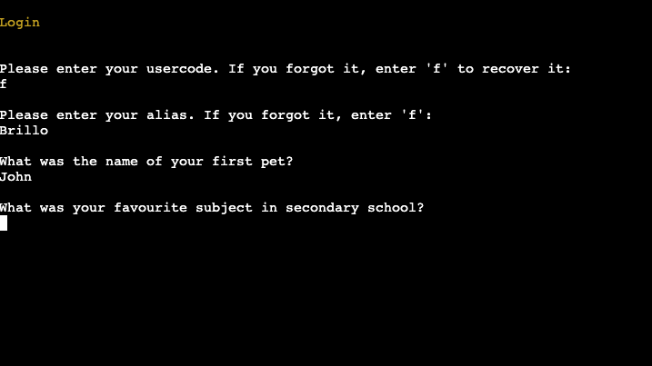
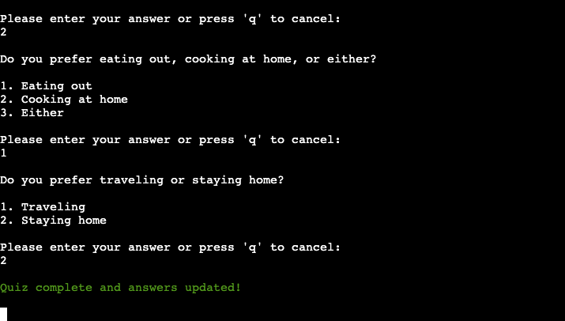

# Console Connections - CI PP3

[Click here to use the live Console Connections App](https://console-connections-5cf111ff9c73.herokuapp.com)

Console Connections is a terminal-based dating app. By setting your age and gender preferences, and answering a few compatibility questions, you can find a match (or matches). Once both of you have allowed for contact, you can send messages to each other. The app runs in the Code Institute Mock Terminal, which is deployed on Heroku.


## Table of Contents

- [**Using the app - Login/Registration steps**](#using-the-app---loginregistration-steps)
  - [**Establishing user type**](#establishing-user-type)
  - [**Signing up**](#signing-up)
  - [**Logging in**](#logging-in)
- [**Using the app - After logging in**](#using-the-app---after-logging-in)
  - [**Main menu**](#main-menu)
  - [**Compatibility quiz**](#compatibility-quiz)
  - [**Edit profile**](#edit-profile)
  - [**View matches**](#view-matches)
  - [**View messages**](#view-messages)
  - [**Log out**](#log-out)
- [**Planning**](#planning)
  - [**User stories**](#user-stories)
  - [**Flowcharts**](#flowcharts)
    - [**Flowchart before logging in or signing up**](#flowchart-before-logging-in-or-signing-up)
    - [**Flowchart after logging in or signing up**](#flowchart-after-logging-in-or-signing-up)
  - [**Google sheet headings**](#google-sheet-headings)
  - [**Messages structure**](#messages-structure)
- [**Features**](#features)
  - [**Test mode or real mode**](#test-mode-or-real-mode)
  - [**Login and signup options**](#login-and-signup-options)
  - [**Unique usercode generation**](#unique-usercode-generation)
  - [**Security questions and answers for credential recovery**](#security-questions-and-answers-for-credential-recovery)
  - [**Credentials recovery**](#credentials-recovery)
  - [**Main menu**](#main-menu-1)
  - [**Compatibility quiz**](#compatibility-quiz-1)
  - [**Edit profile**](#edit-profile-1)
  - [**View matches**](#view-matches-1)
  - [**View messages**](#view-messages-1)
  - [**Add matches to allow contact list**](#add-matches-to-allow-contact-list)
  - [**Message matches**](#message-matches)
  - [**Log out**](#log-out-1)
- [**Testing**](#testing)
- [**Deployment**](#deployment)
  - [**Google Sheets**](#google-sheets)
  - [**Local Deployment**](#local-deployment)
  - [**Before remote deployment**](#before-remote-deployment)
  - [**Deployment on Heroku**](#deployment-on-heroku)
  - [**Creating a fork**](#creating-a-fork)
  - [**Cloning Repository**](#cloning-repository)
- [**Resources used**](#resources-used)


## Using the app - Login/Registration steps

### Establishing user type
When the user runs the app, they are presented with the option to choose whether they are a test user or a real user. The reason for this is that the app is connected to a Google Sheet, and the test sheet is full of dummy data (and other test user data), so it's best to use the test user option to avoid messing up the real user data.

### Signing up
After selecting whether or not the user is a test user or real user. The user will be given the opportunity to log in or sign up for an account. When they choose to sign up, a six-digit usercode is generated for them. If they complete the signup process, that will be their usercode for logging in in the future. During the signup process, the user is asked to create a password, add two security questions (for password/usercode recovery) and to create an alias any in-app communication. Once they have provided that information, the user's information is added to the Google Sheet. They are also logged in and taken to the main menu.

### Logging in
When the user chooses to log in, they are asked to provide their usercode. Since the Google Sheet type is already selected, the usercode is checked against the Google Sheet. If the usercode is found, the user is asked to provide their password. If the password is correct, the user is logged in and taken to the main menu. If the password is incorrect, the user is asked to try again.

## Using the app - After logging in

### Main menu
Once logged in, the user is presented with the main menu. From here, they can choose to view their compatibility quiz answers or take the quiz, edit some of their profile details, view their matches, view their messages, message their matches or log out.

### Compatibility quiz
The compatibility quiz is a series of ten questions. The user is presented with a question that has two to four options. They can choose one of the options by typing the number of the option. Once they have answered all ten questions, their answers are saved to the Google Sheet. If they choose to retake the quiz, they are taken back to the start of the quiz. If they choose not to retake the quiz, they are taken back to the main menu.

### Edit profile
On the edit profile page, the user is presented with the information they can't change and the information that they can change. The user can update their password, their security questions, their bio, the genders they want to match with and the age range they want to match with. If they make a change to their profile, it won't be saved until they click the "Save and exit" option. Once they save, the data is updated in the Google Sheet and they are taken back to the main menu.

### View matches
On the view matches page, the user is presented with a list of their matches. A potential match will only be considered when:
1. The potential match's age is within the age range that the user wants to match with.
2. The user's age is within the age range that the potential match wants to match with.
3. The potential match's gender is one of the genders that the user wants to match with.
4. The user's gender is one of the genders that the potential match wants to match with.

Once other users are filtered by gender and age preferences, the answers of the compatibility tests are compared. A user must have a compatibiltiy score of 60% or more in order to display a match. The list is sorted by the matches with the highest compatibility. From there, the user can choose to view the match's profile. If both users have allowed for contact, the user can also choose to message the match.

### View messages
On the view messages page, the user is presented with a list the last messages sent by their matches. The list is sorted by the most recent message received from a match. The user can choose to view the messages from a match. From there, they can choose to send a message to the match.

### Log out
When the user chooses to log out, they are logged out and taken back to the login/signup page.

## Planning

### User stories

As a first-time user, I want:
- to be able to sign up for an account
- to be able to edit my profile
- to be able to take a compatibility quiz
- to be able to view my matches
- to log out of my account

As a returning user, I want:
- to be able to log in to my account
- to be able to edit my profile
- to be able to view my messages
- to be able to message my matches

As a frequent user, I want:
- to be able to edit my profile
- to be able to view my message history
- to see new matches as they become available
___
### Flowcharts
#### Flowchart before logging in or signing up


#### Flowchart after logging in or signing up


___
### Google sheet headings

I used Google Sheets to store user's data, compatibility quiz answers and messages. There were some iterations of the headings used in the sheet:

#### Initial Google Sheet headings:
```
usercode, password, alias, security_question_1,security_answer_1, security_question_2, security_answer_2, bio, gender, genders_seeking, age, age_range_seeking, messages_sent, messages_received, allow_contact_list, question_1, question_2, question_3, question_4, question_5, question_6, question_7, question_8, question_9, question_10 
```
#### Second iteration of Google Sheet headings:
```
usercode, password, alias, security_questions, age, gender, bio, genders_seeking, age_range_seeking, messages_sent, messages_received, allow_contact_list, compatibility_answers
```
#### Final iteration of Google Sheet headings:
```
usercode, password, alias, security_questions, age, gender, bio, genders_seeking, age_range_seeking, messages, allow_contact_list, compatibity_answers, row_num             
```
___
### Messages structure

The structure of messages was a little tricky as it required some nested lists. I decided to store the messages in the Google Sheet as a string. I used the json module to convert the string to a list. I used the following message structure in user's message section:
```
[
 [usercode, last_message_received_timestamp, 
  [
   [message, user_sent(true/false), timestamp],
   [message, user_sent(true/false), timestamp]
  ]
 
 ],
 [another_usercode, last_message_received_timestamp, 
  [
   [message, user_sent(true/false), timestamp],
   [message, user_sent(true/false), timestamp]
  ]
 ],
 [another_usercode, last_message_received_timestamp, 
  [
   [message, user_sent(true/false), timestamp],
   [message, user_sent(true/false), timestamp]
  ]
 ]
]
```

## Features

### Test mode or real mode

Users can choose whether to use test data or if they want to actually use the app.<br>

 

### Login and signup options
Existing users can sign in and new users can sign up.<br>


### Unique usercode generation
Each user is assigned a unique usercode to log into the app.<br>


### Security questions and answers for credential recovery
Users can set two security questions and answers to help them recover their password or usercode. <br>


### Credentials recovery
If a user forgets their username or password, they can recover it by going through some steps like providing their alias along with security questions.




### Main menu
The main menu after users have logged in. Provides users with a number of options to choose from. <br>


### Compatibility quiz
Users can take a compatibility quiz to help them find matches. <br>




### Edit profile
Users can edit their profile details. <br>


### View matches
Users can view their matches. Matches with a compatibility score of 85 or more get a little fire.<br>


### View messages
Users can view their latest messages with all matches, then choose which one they want to see the full conversation for.<br>


### Add matches to allow contact list

Users have an extra layer of security because they can choose to allow contact from a match. Both users must allow contact in order to message.<br>


### Message matches
Users can message their matches. <br>


### Log out
Users can log out of their account and is displayed a message, which later updates to the login/signup screen.


## Testing

You can view the full testing process [in the TESTING.md file](TESTING.md).

## Deployment

### Google Sheets
The application stores data in a Google Sheet. The credentials for the communicating with the sheet and should be saved in a file titled `creds.json`. To generate your Google Sheet credentials, follow these steps:
1. Go to the [Google Developers Console](https://console.developers.google.com/)
2. Create a new project
3. Enable the Google Drive API
4. Create credentials for a Web Server to access Application Data
5. Name the service account and grant it a Project Role of Editor
6. Download the JSON file
7. Copy the JSON file to your code directory and rename it to creds.json
8. In the JSON file, change the email address to the one you are sharing your Google Sheet with
9. In the Google Sheet, share the sheet with the email address in the JSON file

### Local Deployment
To run the project locally, you will need to Python, Git and pip installed. You will also need to install the `requirements.txt` dependencies by running the following command in the terminal:
```
pip3 install -r requirements.txt
```
To run the project, run the following command in the terminal:
```
python3 run.py
```
You can stop the project from running by pressing `Ctrl + C` in the terminal.

### Before remote deployment
To ensure the application is deployed correctly on Heroku, you must update the requirements.txt. This is a list of requirements that the application needs in order to run. 
- To create the list of requirements we use the command `pip3 freeze > requirements.txt`. This will ensure the file with the requirements is updated. If you run the command on VSCode, you should also make sure to remove anything after and including the `@path` beside each of the modules.
- Commit and push the changes and push to GitHub.
### Deployment on Heroku
- To deploy the project on [Heroku](https://www.heroku.com), first create an account.
- Once logged in, create a new app by clicking on the create app button
- Pick a unique name for the app, select a region, and click create app.
- On the next page select the settings tab and scroll down to Config Vars. If there are any files that should be hidden like credentials and API keys they should be added here. In this project, there are credentials that need to be protected. To do this I have created a config var and added CREDS as the key and the content of the creds.json file as a value.
- Scroll down to Buildpacks. The Buildpacks will install further dependencies that are not included in the `requirements.txt`. For this project, there are two Buildpacks required - Python and Nodejs.
- Select the deploy section from the tab in the menu. 
- The deployment method for this project is GitHub. Once selected, confirm that we want to connect to GitHub, search for the repository name and click connect to connect the Heroku app to our GitHub code. 
- Scroll further down to the deploy section where automatic deploys can be enabled, which means that the app will update every time code is pushed to GitHub. Click deploy and wait for the app to be built. Once this is done, a message should appear letting us know that the app was successfully deployed with a view button to see the app.

### Creating a fork
1. Navigate to the [repository](https://github.com/stephendawsondev/ConsoleConnections)
2. In the top-right corner of the page click on the fork button and select "Create a fork".
3. Change the name of the fork and add a description 
4. Choose to copy only the main branch to the new fork. 
5. Click "Create a Fork". A new repository should appear in your GitHub.

### Cloning Repository
1. Navigate to the [repository](https://github.com/stephendawsondev/ConsoleConnections)
2. Click on the Code button on top of the repository and copy the link. 
3. Open Git Bash and change the working directory to the location where we want the cloned directory. 
4. Type git clone and then paste the link.
5. Press Enter to create our local clone.


## Credits
### Resources used

- [TODOs in Python](https://www.jetbrains.com/help/pycharm/using-todo.html#view_todo)
- [Lucidchart for flowcharts](https://lucid.app/)
- [Understanding Python Option arguments](https://realpython.com/python-optional-arguments/)
- [FreeCodeCamp Python Regex](https://www.freecodecamp.org/news/how-to-import-a-regular-expression-in-python/#howtousethepythonremodulewithregex)
- [Console Connections font](https://patorjk.com/software/taag/#p=display&h=2&v=1&f=NV%20Script&t=Console%20Connections)
- [Stackoverflow question on generating random numbers](https://stackoverflow.com/questions/2673385/how-to-generate-a-random-number-with-a-specific-amount-of-digits)
- [Code to clear the console](https://www.delftstack.com/howto/python/python-clear-console/)
- [Corey Schafer Python Tutorials on Classes](https://www.youtube.com/@coreyms)
- [update_cell method from Gspread](https://docs.gspread.org/en/latest/user-guide.html)
- [json module in Python](https://docs.python.org/3/library/json.html)
- [re.sub() method explanation](https://www.pythontutorial.net/python-regex/python-regex-sub/)
- [Sorting list by nest list value - Stackoverflow](https://stackoverflow.com/a/65679191/12297743)
- [Gspread user guide to update a full row](https://docs.gspread.org/en/latest/user-guide.html#updating-cells)
- [Avoiding circular imports](https://medium.com/brexeng/avoiding-circular-imports-in-python-7c35ec8145ed)
- [User is not subscriptable error explanation](https://blog.jcharistech.com/2022/02/07/how-to-fix-typeerror-object-is-not-subscriptable/)
- [Documentation on catching Python warnings](https://docs.python.org/3/library/warnings.html)
- [Colours in the terminal](https://sparkbyexamples.com/python/print-colored-text-to-the-terminal-in-python)
- [Heart colour tunnel image](https://openclipart.org/detail/289906/heart-8-colour-2)

### Acknowledgements
- [Code Institute](https://codeinstitute.net/) for the Mock Terminal
- [Code Institute](https://codeinstitute.net/) for the Google Sheets module and the Love Sandwich project that thought me how to interact with Google sheets
- A huge thank you to my mentor [David Bowers](https://github.com/dnlbowers) for his encouragement to try implementing more Object Oriented Programming in the project, and for his guidance throughout the project.
- The #peer-code-review channel on Slack for their feedback on the project.
- My friends and family for their patience in testing the project and creating many, many test accounts. 

